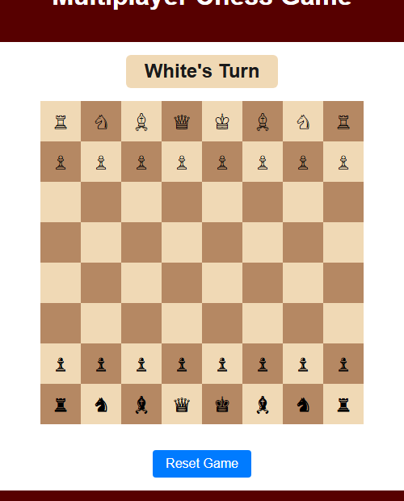
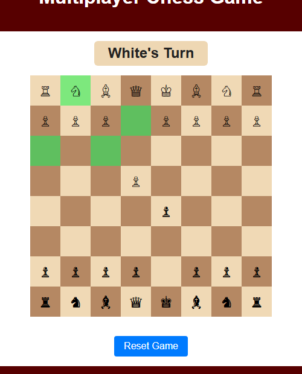
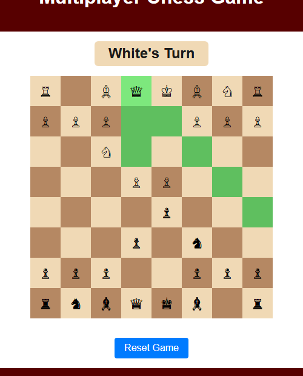
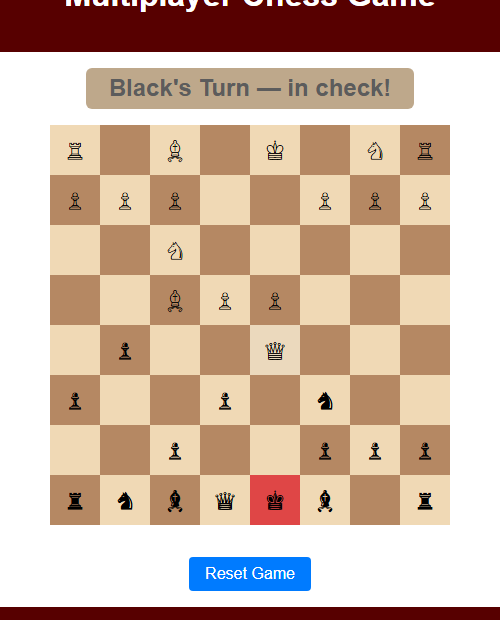

# Chess

A local two-player chess game that runs in the browser with no setup.

I started this project in my second year of BE Computer Science at Jyothy Institute of Technology, VTU. It was a learning exercise while I was getting to grips with JavaScript. The original version only had pawn movement. I came back to it later and finished the full game.

## What this is

Two people play on the same screen, taking turns. This is a hotseat game, not an online multiplayer game. Both players share one browser window and hand the keyboard and mouse back and forth.

## How to run

Download or clone the repository, then open `index.html` in any browser. That is all. No server, no build step, no dependencies.

## Screenshots

### Starting position

All 32 pieces on the board, white to move first.

### Move hints

Click any piece to select it. Every legal move lights up in green. Here the white knight on b1 shows its three available L-shape jumps.

### Queen range

The queen highlights all the squares it can reach in one move, across ranks, files, and diagonals. Moves that would leave the king in check are filtered out and not shown.

### Check detection

When a king is under attack, the square turns red and the turn indicator says "in check!". The player must resolve the check before making any other move.

## How to play

1. Click a piece to select it. Legal moves highlight in green.
2. Click a highlighted square to move there.
3. Click the same piece again to deselect it.

## What the game supports

- All standard piece movements: pawns, rooks, bishops, queens, knights, and kings
- Check detection with a red highlight on the king in check
- Checkmate detection with a win message
- Stalemate detection with a draw message
- Castling on both kingside and queenside for both colours
- Pawn promotion to queen when a pawn reaches the back rank
- Illegal moves are blocked, including moves that would leave your own king in check

## Reset

Click the Reset Game button at any time to start a new game.

## Links

[GitHub](https://github.com/achalnm) | [LinkedIn](https://www.linkedin.com/in/achal-n-35153821b/) | [Instagram](https://instagram.com/achal_n26)
